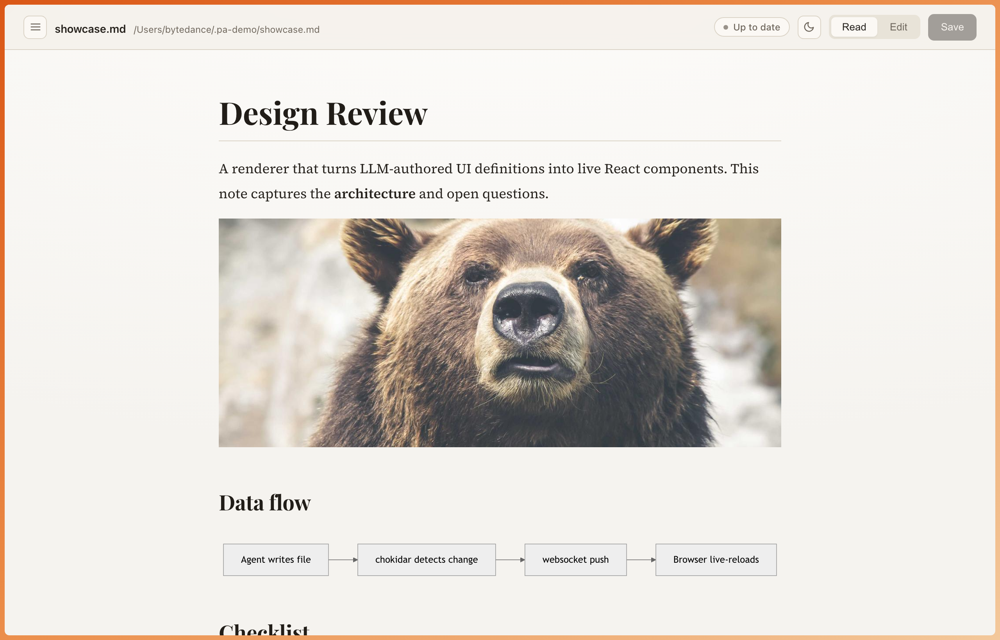
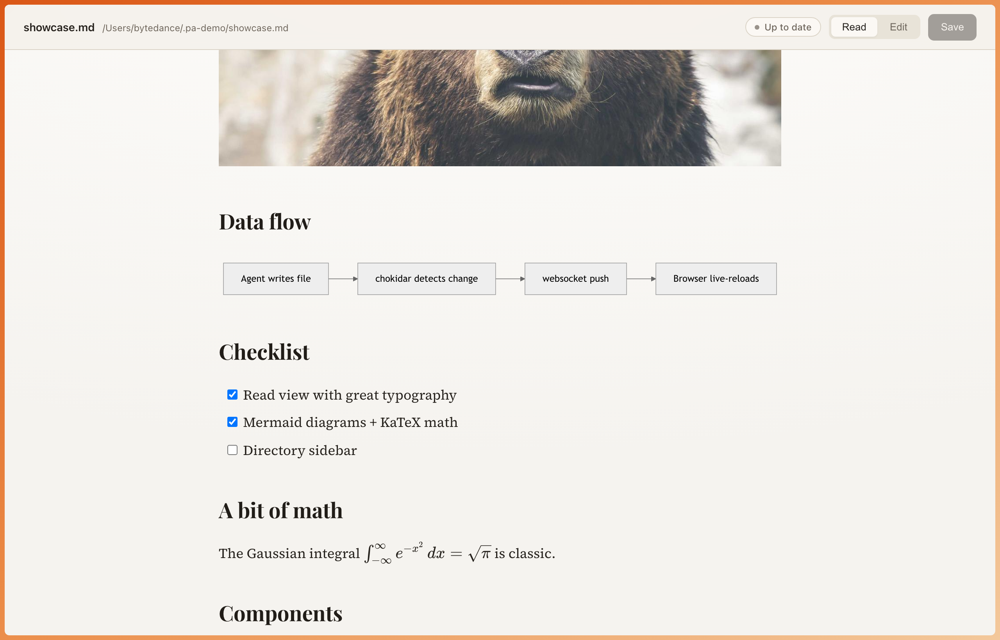
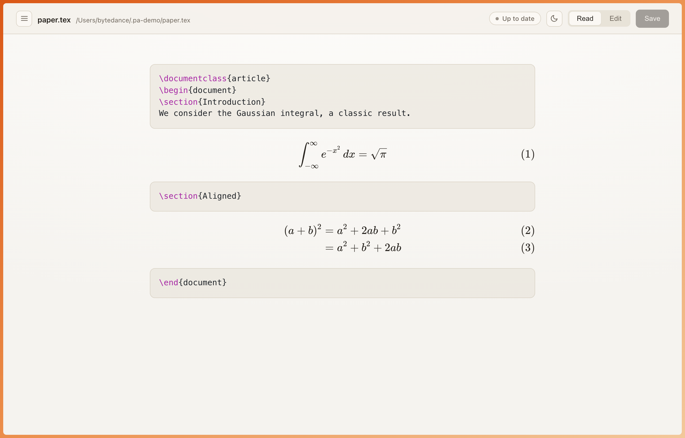
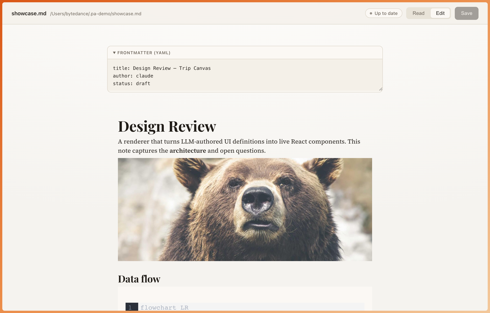

# preview-artifact

Open the artifacts your coding agents produce (plans, design docs, audit
reports, papers) in the browser — **read them beautifully, edit them in place,
save back to disk, and live-reload** when an agent rewrites the file.


Handles **Markdown** (`.md`), **LaTeX** (`.tex`), and **PDF** (`.pdf`), with a
light and dark theme.

Fully local. No cloud, no telemetry, no account.

```bash
preview-artifact open docs/plans/2026-05-31-some-design.md
```

## Screenshots

Editorial read view — serif display type, warm paper, orange frame:


Rich markdown — images, headings, and a live mermaid diagram, GFM tables, task
lists and KaTeX math:




LaTeX (`.tex`) — equations typeset by KaTeX over highlighted source:



WYSIWYG edit mode (Milkdown) with the YAML frontmatter split into its own panel:



## Why

Terminal markdown is hard to read and IDE preview is read-only & bland. AI
artifacts are code-heavy — fenced code, mermaid diagrams, GFM tables, YAML
frontmatter, task lists — and deserve a real reading surface you can also edit.

## Features

- **Read mode** — rich typography (GitHub markdown CSS), syntax-highlighted
  code (highlight.js), rendered **mermaid** diagrams, GFM tables and task lists,
  **KaTeX math** (`$…$` / `$$…$$`), and **images** (remote URLs plus local files
  resolved relative to the document, in both read and edit modes).
- **LaTeX (`.tex`)** — display equations typeset by KaTeX with the rest shown as
  highlighted LaTeX source; editable and saveable as plain source.
- **PDF (`.pdf`)** — embedded read-only viewer.
- **Edit mode** — Milkdown (ProseMirror) WYSIWYG that round-trips markdown
  faithfully. YAML frontmatter is split into its own panel so the editor can
  never corrupt it.
- **Save** — writes back to the same file. `Cmd/Ctrl+S`.
- **Live-reload** — a file watcher pushes external changes over a websocket; if
  you have unsaved edits it asks before discarding them.
- **Toggle** — `Cmd/Ctrl+E` flips Read ⇄ Edit.

## Install

Requires Node ≥ 18.

```bash
npm install -g preview-artifact
```

<details>
<summary>Other ways to install</summary>

```bash
# latest from GitHub
npm install -g github:anup-a/preview-artifact

# local clone (for development) — npm install runs the build automatically
git clone https://github.com/anup-a/preview-artifact.git
cd preview-artifact && npm install && npm link
```
</details>

## Usage

```bash
preview-artifact open path/to/file.md   # open in the browser
preview-artifact path/to/file.md        # shorthand
preview-artifact open file.md --no-open # start server without launching a browser
preview-artifact --help
```

Use it from any project — it's not tied to any particular repo.

## Use it from your coding agent

This tool is meant to be launched *by* your agent when it finishes writing an
artifact. The CLI self-daemonizes and returns immediately, so agents just run it
— no backgrounding needed. The preferred integration is the **skill**, which the
model auto-invokes when you ask to preview something or after it writes a plan
(no slash command to remember). See [`AGENTS.md`](./AGENTS.md) for details.

> **CLI vs skill.** The `preview-artifact` **npm package is the actual program**
> (it runs the viewer). The **skill** is just instructions telling the agent when
> to run it — so installing the skill alone is enough: on first use it runs
> `npm install -g preview-artifact` for you if the CLI is missing. Prefer the CLI
> directly? Just `npm install -g preview-artifact` and skip the skill.

### Skill (any agent — recommended)

Install the [`preview-artifact` skill](./skills/preview-artifact/SKILL.md) into
your agent (Claude Code, Cursor, …) via the open [skills](https://skills.sh) CLI:

```bash
npx skills add anup-a/preview-artifact
```

### Claude Code (plugin)

Or install it as a plugin from this repo's marketplace (ships the same skill):

```
/plugin marketplace add anup-a/preview-artifact
/plugin install preview-artifact@preview-artifact
```

### Codex (custom prompt)

Adds a `/preview-artifact` slash command to Codex. See
[`plugins/codex/`](./plugins/codex/):

```bash
mkdir -p ~/.codex/prompts
cp plugins/codex/prompts/preview-artifact.md ~/.codex/prompts/
```

### Cursor / Aider / other shell agents

They read `AGENTS.md` automatically and can launch it directly:

```bash
preview-artifact open path/to/file.md   # prints the URL, then returns
```

### If `preview-artifact` isn't on your agent's PATH

`npm install -g` puts the binary in npm's global bin. If your agent runs with a
minimal PATH and can't find it, add npm's global bin to PATH:

```bash
export PATH="$(npm prefix -g)/bin:$PATH"
```

…or run it straight from the cloned repo without linking at all:

```bash
node bin/preview-artifact.js open file.md   # from the preview-artifact/ dir
```

## How it works

One shared **daemon** serves every file; the file is passed as a `?path=` query
parameter rather than getting its own server/port. The CLI auto-starts the
daemon (detached) on first use, reuses it afterward, and records its port in
`~/.preview-artifact/daemon.json`.

```
bin/preview-artifact.js  CLI — ensures the daemon is up, opens /?path=<file>
server/index.mjs         daemon: serves the SPA, GET/PUT /api/file?path=,
                         GET /api/raw?path= (pdf bytes), /ws?path= live-reload
src/                     Vite + React SPA
  App.tsx                  orchestration: load, read/edit toggle, save, reload
  readview.ts              markdown-it + highlight.js + mermaid + KaTeX (read mode)
  Editor.tsx               Milkdown Crepe wrapper (markdown edit mode)
  frontmatter.ts           split/join YAML frontmatter so it never round-trips
.claude/commands/        Claude Code /preview-artifact slash command
AGENTS.md                instructions for coding agents
```

- Binds to `127.0.0.1` only and sets no CORS headers, so cross-origin pages
  can't read API responses or perform preflighted writes.
- Markdown frontmatter is sliced off before the editor sees the body and
  re-attached verbatim on save, so YAML survives editing untouched.

## Development

```bash
node server/index.mjs                 # start the daemon (default port 4317)
npm run dev                           # Vite dev server, proxies /api + /ws to 4317
# then open http://localhost:5173/?path=/abs/path/to/file.md
npm run typecheck
```

After any change under `src/`, run `npm run build` — the daemon serves the built
`dist/`, not live source.

## Scope

v1 is deliberately single-file. No directory browser, auth, multi-user, or
collaboration — git already handles history.

## License

MIT
