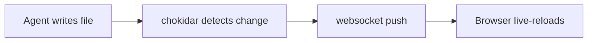

# Artifact Viewer Demo

A quick artifact to exercise the renderer. This is the kind of **markdown**
that coding agents emit: prose, tables, code, checklists, and diagrams.

## Why this exists

Terminal markdown is hard to read; IDE preview is read-only. This opens the
file in the browser, renders it _beautifully_, and lets you edit it back.

## A task list

- [x] Read view with great typography
- [x] Mermaid diagrams
- [ ] Edit mode with Milkdown
- [ ] Live-reload on external change

## Some code

```ts
export function greet(name: string): string {
  return `hello, ${name}`;
}
```

## A table

| Component | Role            | Local? |
| --------- | --------------- | ------ |
| Fastify   | file API + ws   | yes    |
| Milkdown  | WYSIWYG editor  | yes    |
| mermaid   | diagram render  | yes    |

## A diagram



> Edit this file in another editor while it's open — the browser updates live.
